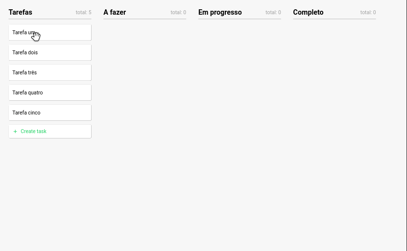

# Kanban Board

Um desafio para recriar um quadro kanban, utilizando React.js, onde é possível mover os cartões entre as colunas.

Veja o projeto - [Link para o site](https://kanban-challenge.netlify.app/)

### Tecnologias

-   react.js
-   react-beautiful-dnd
-   react icons

### Demo

